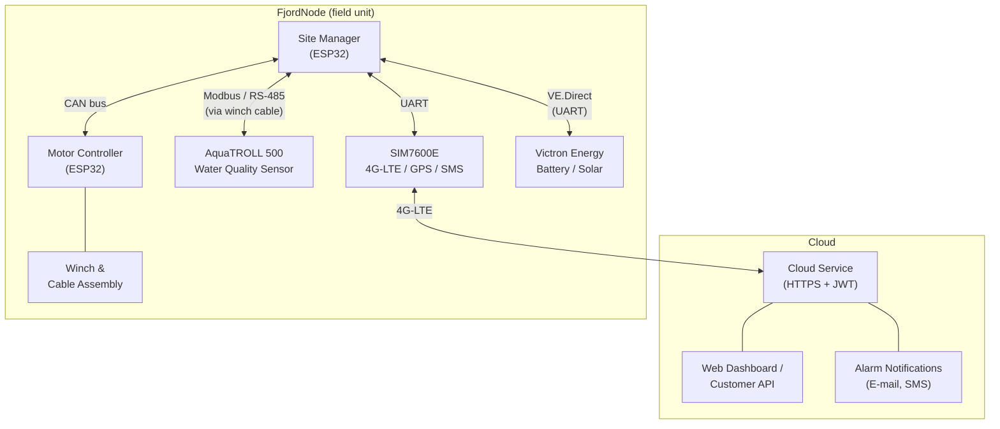
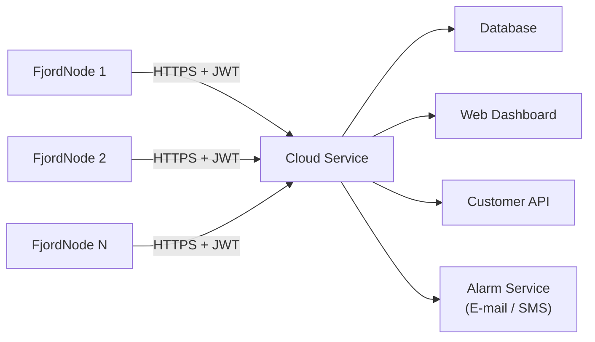
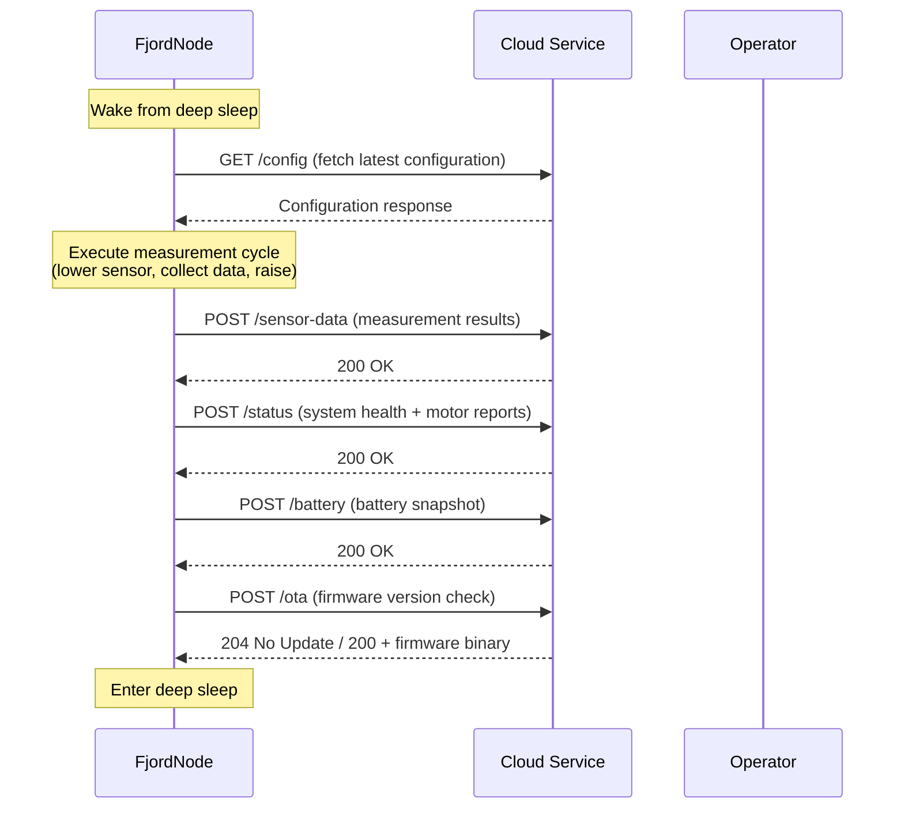
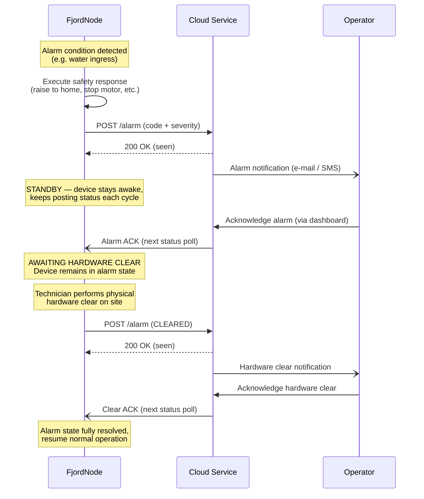
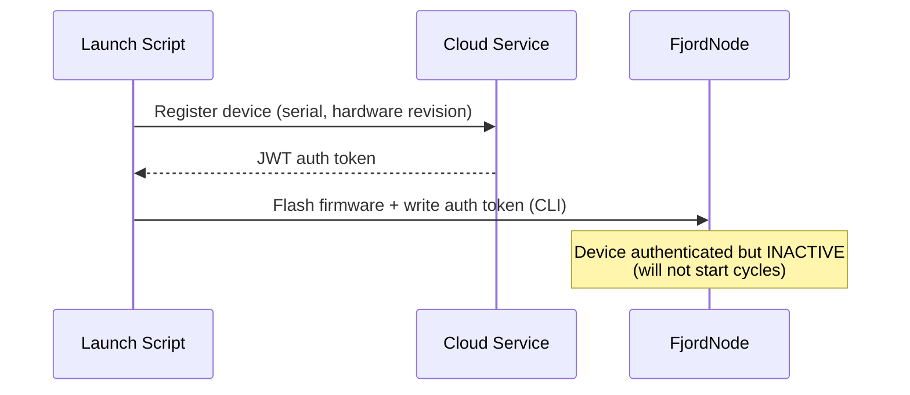
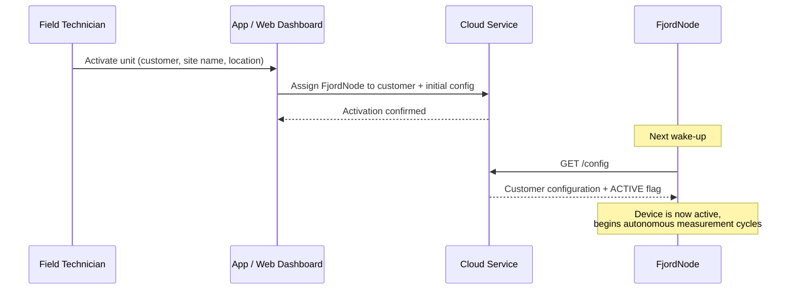
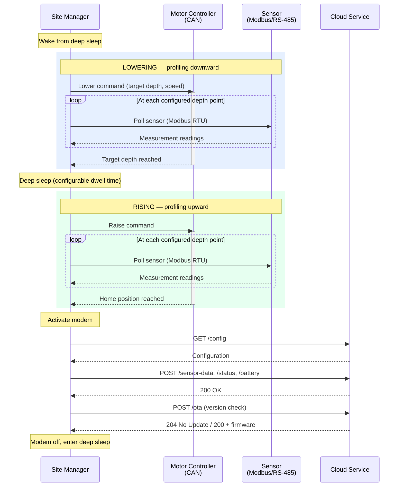
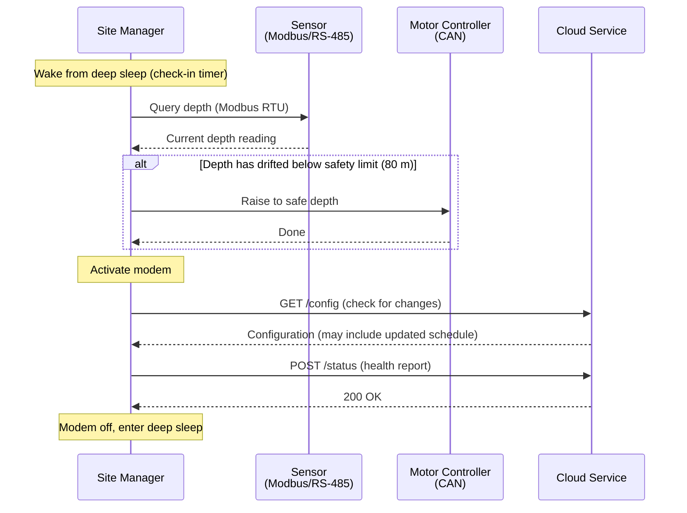
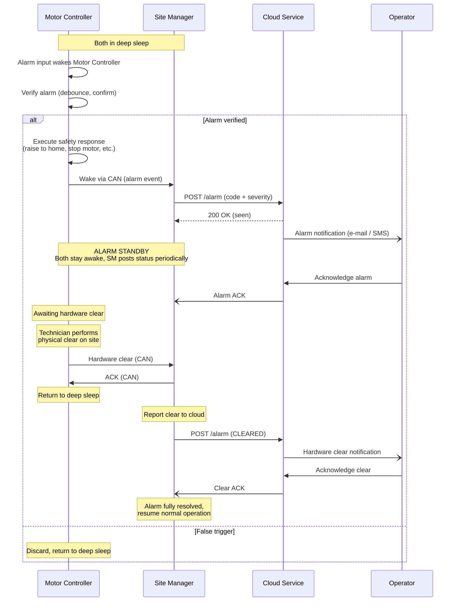
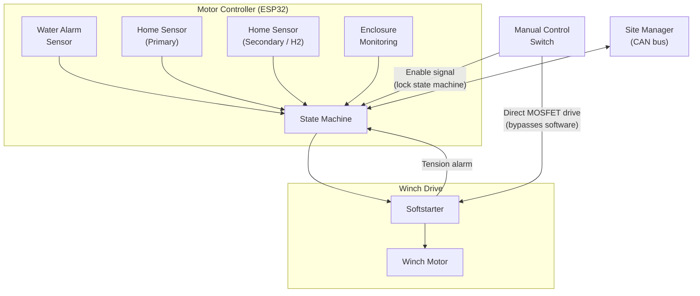

# FjordNode System Architecture

## 1. System Overview

A **FjordNode** is an autonomous water-profiling station deployed in saltwater fjords.
It periodically lowers a sensor through the water column (up to 80 m depth, 100 m cable),
collects measurements at configured depths, raises the sensor, and transmits the
collected data to a central cloud service over cellular (4G-LTE).

The system operates unattended on battery and solar power. All units run identical
firmware and are provisioned in the field via the cloud service.

## 2. Deployment Environment

| Parameter | Value |
|-----------|-------|
| Medium | Saltwater (fjords) |
| Max profiling depth | 80 m |
| Cable length | 100 m (margin for drift/current) |
| Installation | Floating buoy, moored |
| Power | Battery + solar (see section 8) |
| Operating temperature | *TBD* |
| Enclosure rating | *TBD (IP-rating)* |

## 3. Communication Interfaces

### 3.1 Cellular — SIM7600E Module

The SIM7600E module provides the sole long-range communication link between the
FjordNode and the cloud service.

| Capability | Usage |
|------------|-------|
| 4G-LTE data | All cloud communication (HTTPS) |
| GPS | Position reporting, drift detection |
| SMS | Fallback alarm delivery (optional) |

The module is connected to the Site Manager via UART and is only powered on during
the communication phase of each measurement cycle to conserve energy.

### 3.2 Sensor — Modbus / RS-485

The AquaTROLL 500 water quality sensor is connected to the Site Manager via
**Modbus RTU over RS-485**. The signal conductors run through the winch cable itself,
meaning the same physical cable serves as both the mechanical suspension and the
data/power link to the sensor.

- Protocol: Modbus RTU (master: Site Manager, slave: sensor)
- Physical layer: RS-485, half-duplex
- Cable length: up to 100 m

### 3.3 Motor Controller — CAN Bus

The Motor Controller is a separate ESP32 responsible for all winch operations and
environmental inputs. It communicates with the Site Manager over **CAN bus**.

- Protocol: CAN 2.0B
- Usage: Motor commands, status reports, alarm signalling
- Physical layer: CAN transceiver, twisted pair

### 3.4 Battery Monitoring — VE.Direct

The Site Manager monitors the power system through the **VE.Direct** protocol
(Victron Energy proprietary, UART-based). This provides real-time battery voltage,
state of charge, current, power, and accumulated charge statistics.

### 3.5 Optional WiFi Soft AP

The Site Manager can activate a temporary WiFi access point (Soft AP). In the
current design this serves two purposes:

1. **Motor Controller OTA** — the Motor Controller connects to the AP to receive
   firmware updates pulled from the cloud by the Site Manager.
2. **Future expansion** — additional peripherals could connect to the AP for
   configuration or data transfer.

The Soft AP is **normally off** and only activated briefly when needed. If the AP
introduces complications for CE compliance, an alternative OTA path exists: the
Site Manager can pull the firmware and relay it to the Motor Controller over the
existing CAN bus link, eliminating the need for WiFi entirely.

| Radio | Frequency | State |
|-------|-----------|-------|
| SIM7600E (4G-LTE) | Licensed LTE bands | Active during communication phase |
| ESP32 WiFi (Site Manager) | 2.4 GHz ISM | Normally off, brief AP activation |
| ESP32 WiFi/BLE (Motor Controller) | 2.4 GHz ISM | Normally off, brief STA for OTA |

## 4. Cloud Service

### 4.1 Overview

A single cloud server manages the entire fleet of FjordNodes. All communication
uses **HTTPS with JWT authentication**. Each FjordNode identifies itself with a
unique token issued during provisioning.

### 4.2 Communication Protocol

All FjordNode-to-server communication is initiated by the FjordNode (the server
never initiates a connection to the device). On each cycle, the FjordNode:

#### Alarm Protocol

When a safety condition is detected (water ingress, tension fault, etc.), the
FjordNode enters **alarm mode** and remains awake until the alarm is fully resolved.
The alarm lifecycle involves both a software acknowledgement from the operator and
a physical (hardware) clear on the device.

During alarm standby the FjordNode continues to post status updates so the
operator has visibility. The device will not enter deep sleep while in alarm
state, unless it sinks.

### 4.3 Data Served

| Data | Direction | Description |
|------|-----------|-------------|
| Configuration | Server → Device | Measurement schedule, depth points, timing |
| Sensor data | Device → Server | Water quality readings per depth |
| System status | Device → Server | Motor reports, sensor health, device state |
| Battery | Device → Server | Voltage, SoC, current, power, history |
| OTA firmware | Server → Device | Binary images for Site Manager and Motor Controller |
| Alarms | Device → Server | Water ingress, motor faults, battery warnings |
| Alarm ACK | Server → Device | Operator acknowledgement of alarms |

### 4.4 Customer Integration

The cloud service exposes a **REST API** that customers can use to integrate
FjordNode data into their own systems. The web dashboard provides:

- Real-time and historical measurement data
- Configuration management per FjordNode
- Alarm overview with notification routing (e-mail, SMS)
- Fleet management (status of all deployed units)

## 5. Fleet Provisioning

All FjordNodes run **identical firmware**. No unit-specific configuration is
compiled into the binary. Provisioning is a two-phase process: factory setup
followed by field activation.

### Phase 1 — Factory / Office Setup

During firmware loading, a launch script registers the device with the cloud
service and writes the authentication token to the device via CLI. The device
is now authenticated but **inactive** — it will not begin measurement cycles.

### Phase 2 — Field Activation

When the FjordNode is deployed at a site, a technician activates it via an app
or the web dashboard. This assigns the unit to a customer and writes the
site-specific configuration (measurement schedule, location, customer credentials).

After activation, the FjordNode operates autonomously. Configuration changes are
applied remotely through the cloud service and picked up by the device on its next
wake cycle.

## 6. Operational Cycles

The FjordNode alternates between two types of cycles: the **measurement cycle**
(lower, profile, raise, upload) and periodic **check-in cycles** between
measurements.

### 6.1 Measurement Cycle

During a measurement cycle, the Site Manager orchestrates the Motor Controller
and the sensor in parallel. The motor lowers the cable while the sensor
collects readings at multiple configured depth points.

The sensor collects readings at multiple configured depth points during both
the lowering and rising phases. Between the two phases the system enters a
brief deep sleep (configurable dwell time at the bottom).

### 6.2 Check-In Cycle

Between measurement cycles, the FjordNode wakes periodically (configurable,
typically every 5–10 minutes) to perform lightweight housekeeping:

The check-in interval is dynamically adjusted based on customer traffic patterns
to balance power consumption against system availability.

When a configuration change is detected during a check-in, it is applied
immediately — including changes to the measurement interval. The next
measurement cycle start time is recalculated relative to the last completed
cycle. For example: if the interval was 60 minutes and is changed to 30 minutes,
and 20 minutes have already elapsed since the last cycle, the next measurement
will start in 10 minutes rather than waiting for the original 60-minute timer.

### 6.3 Alarm Wake

The Motor Controller monitors environmental inputs (water alarm, enclosure)
even while both processors are in deep sleep. If an alarm condition is detected,
the Motor Controller wakes, verifies the alarm, and if confirmed, wakes the
Site Manager over CAN to report it to the cloud service.

## 7. Motor Controller and Safety

The Motor Controller (ESP32) is a dedicated microcontroller responsible for all
physical actuation and environmental monitoring. It operates independently of the
Site Manager when necessary, ensuring safety responses are not dependent on
software running on a separate processor.

### 7.1 Functional Overview

The Motor Controller does not drive the winch motor directly. It controls a
**softstarter** unit that manages motor power delivery. The softstarter also
provides a tension alarm signal back to the Motor Controller.

The **manual control switch** is wired to drive the motor MOSFETs directly,
completely bypassing all software. When activated, the state machine enters a
full lock — only the physical manual controls operate the winch.

### 7.2 Safety Features

| Feature | Trigger | Response | Priority |
|---------|---------|----------|----------|
| **Manual mode** | Physical switch activation | **All motor driving stops immediately.** Manual switch drives MOSFETs directly, bypassing all software. State machine enters complete lock. Only manual controls can operate the winch. | Highest — overrides all other states including water alarm. |
| **Enclosure breach** | Enclosure sensor triggered | **All motor driving stops immediately**, including during an active water alarm raise. Report alarm to Site Manager via CAN. | Overrides water alarm. |
| **Water alarm** | Water detected inside enclosure | Immediately raise sensor to home position. Wake Site Manager to report alarm to cloud service. Device enters alarm standby (see section 4.2). | High — overridden only by manual mode or enclosure breach. |
| **Tension alarm** | Softstarter reports cable tension fault | Pause and retry (up to 3 attempts) to resolve the tension. If unresolved after retries, stop motor and enter alarm mode. Reported in system status. | Normal |
| **Home position (H1)** | Primary home sensor detects sensor at rest | Stop motor. Confirm completion to Site Manager. | Normal |
| **Home position (H2)** | Secondary home sensor triggered | Warning: the primary home sensor was bypassed. Provides additional safety margin — ensures the sensor does not overrun the home position. | Safety backup |
| **Motor stall** | Overcurrent / no movement detected | Stop motor. Report fault to Site Manager via CAN. | Normal |
| **Communication loss** | No CAN command within expected window | Motor Controller independently returns to safe state (home position). | Normal |

### 7.3 Design Principles

**Stateless executor.** From the Site Manager's perspective, the Motor Controller
receives a command, executes it, and reports the result. It does not maintain
knowledge of the broader system state (which customer, which cycle, etc.).

**Independent safety authority.** The Motor Controller retains full authority over
safety responses. If it detects a hazardous condition, it will override any active
command without waiting for instructions from the Site Manager.

**Hardware override.** The manual control switch and enclosure breach response
operate at the hardware level. Manual mode bypasses software entirely by driving
the motor MOSFETs directly, ensuring that a software fault cannot prevent an
operator from taking physical control of the winch.

## 8. Power System

*This section to be completed with hardware specifications.*

| Component | Details |
|-----------|---------|
| Battery | *TBD* |
| Solar panel | *TBD* |
| Charge controller | Victron (monitored via VE.Direct) |
| Power budget | *TBD* |
| Deep sleep consumption | *TBD* |
| Active cycle consumption | *TBD* |
| Expected autonomy (no sun) | *TBD* |

## 9. Equipment Summary

| Component | Model / Type | Interface | Frequency / Standard | Normally Active |
|-----------|-------------|-----------|---------------------|-----------------|
| Site Manager | ESP32 (Espressif) | — | — | Cyclic (deep sleep between cycles) |
| Cellular modem | SIM7600E | UART to Site Manager | 4G-LTE (licensed bands) | Only during communication phase |
| GPS | SIM7600E (integrated) | Via modem | L1 (1575.42 MHz) | Only during communication phase |
| WiFi (Site Manager) | ESP32 (integrated) | — | 2.4 GHz ISM (802.11 b/g/n) | Normally off |
| WiFi (Motor Controller) | ESP32 (integrated) | — | 2.4 GHz ISM (802.11 b/g/n) | Normally off |
| Motor Controller | ESP32 (Espressif) | CAN bus to Site Manager | — | Cyclic |
| Water quality sensor | AquaTROLL 500 (In-Situ) | Modbus RTU / RS-485 | — | During profiling |
| Battery monitor | Victron SmartShunt | VE.Direct (UART) | — | Always on (low power) |
